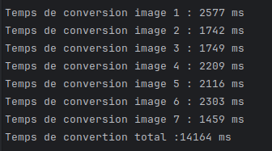
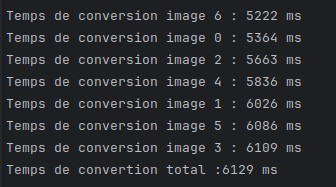

# Projet Convertisseur image

## MVP
### Version non optimisée

Dans la version non-optimisée du MVP avec le parsing des images directement dans une **boucle foreach**
on obtient les temps suivants pour 7 images:

On voit que le traitement ce fait en sequentiel on doit donc attendre la fin du traitement de chaque
pour pouvoir commencer le traitement de l'image suivante

Pour la version optimisée et l'utilisation de **Parallel.ForEach** on voit que le temps total chute,
car ici le traitement se fait de façon parallélisé et non sequentiel.

Ici on voit donc l'interet de l'utilisation de la paréllisation sur des action qui demande du temps
calcul.
